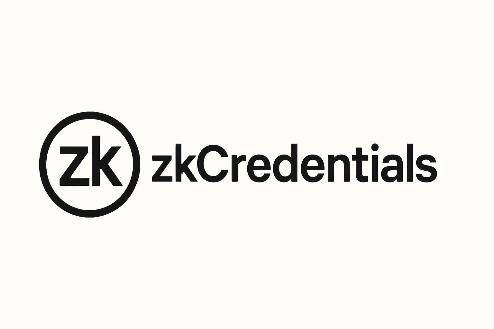
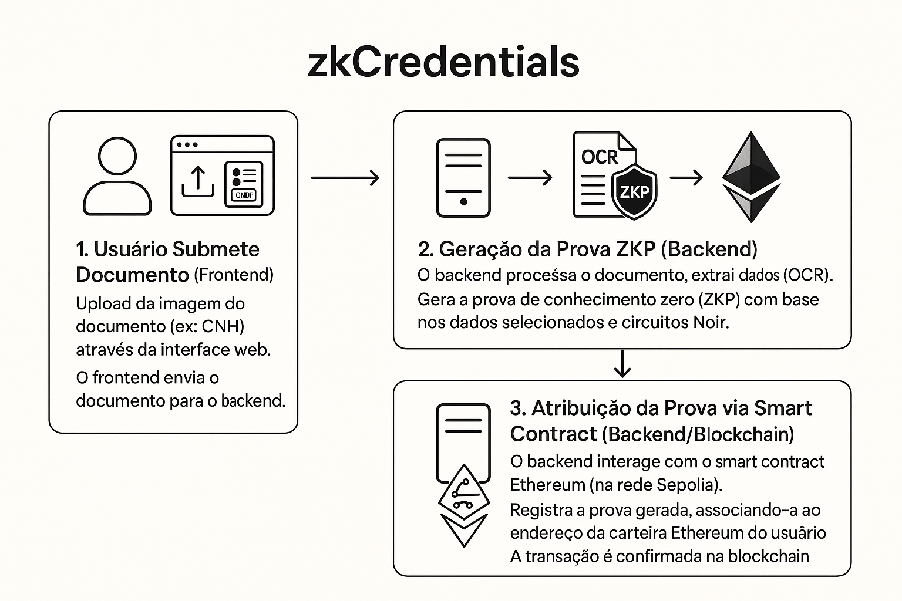
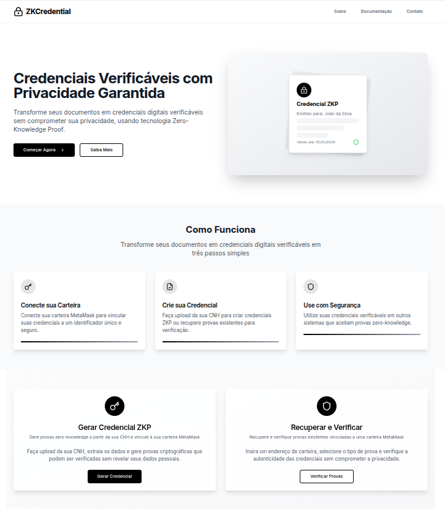
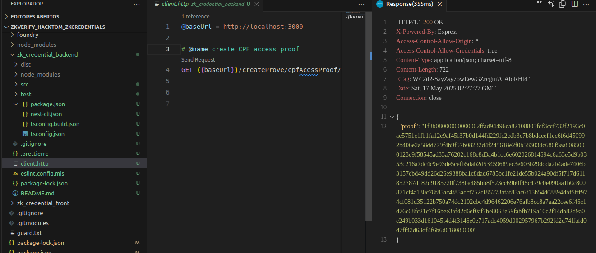

# zkCredential



Sistema de credenciais digitais verificáveis com provas de conhecimento zero (ZKP), focado em privacidade, descentralização e interoperabilidade.


---


## Índice

- [Apresentação do Projeto zkCredential](#visão-geral)
- [Funcionalidades](#funcionalidades)
- [Arquitetura](#arquitetura)
- [Fluxo de Uso](#fluxo-de-uso)
- [Tecnologias Utilizadas](#tecnologias-utilizadas)
- [Instalação e Execução](#instalação-e-execução)
- [Endpoints da API](#endpoints-da-api)
- [Exemplo de Uso](#exemplo-de-uso)
- [Estrutura de Pastas](#estrutura-de-pastas)
- [Segurança](#segurança)
- [Contribuição](#contribuição)
- [Licença](#licença)
- [Contato](#contato)

---

## 🎥 Apresentação do Projeto zkCredential
https://github.com/vdsilveira/zkVerify_hacktom_zkCredentials/assets/122502607/6d7db9ff-4f8c-46ef-9a89-dcc10dc0d258


### Sobre o Vídeo

Este vídeo apresenta o projeto **zkCredential**, explicando como ele transforma documentos físicos em **credenciais digitais seguras** utilizando **provas de conhecimento zero (ZKP)**. A apresentação destaca as principais funcionalidades, a arquitetura do sistema e os benefícios da solução em termos de **privacidade e segurança**.

### Sobre o Projeto

O **zkCredential** é uma solução inovadora que converte documentos físicos (como a CNH) em credenciais digitais protegidas por **ZKPs (Zero-Knowledge Proofs)**. O sistema garante que apenas dados autorizados sejam revelados, assegurando a **privacidade do usuário**.

Essas credenciais são:
- Vinculadas à carteira **Ethereum** do usuário.
- Registradas via **smart contracts** na rede **Sepolia**.
- Imutáveis e auditáveis, sem expor os dados sensíveis originais.

A zkCredential une **tecnologia Web3** com **privacidade por padrão**, promovendo confiança em ambientes descentralizados.


### Principais Benefícios

- **Privacidade**: Compartilhamento seletivo de informações
- **Segurança**: Proteção por provas criptográficas
- **Descentralização**: Registro em blockchain
- **Interoperabilidade**: Compatível com padrões W3C
- **Usabilidade**: Interface intuitiva e fácil integração

---

## Funcionalidades

### Core Features
- Upload e processamento de documentos (ex: CNH)
- Extração automática de dados via OCR
- Geração de provas ZKP para campos selecionados
- Registro e consulta de provas em smart contract Ethereum
- Verificação de provas sem expor dados sensíveis
- Interface web intuitiva com MetaMask

### Recursos Adicionais
- Suporte a múltiplos tipos de documentos
- Sistema de revogação de credenciais
- Histórico de verificações
- Exportação de provas em formato padrão
- Integração com wallets Web3

### Frontend (Next.js)
- Interface responsiva com Tailwind CSS
- Integração com MetaMask
- Componentes reutilizáveis
- Gerenciamento de estado com React Context
- Validação de formulários

### Backend (NestJS)
- API RESTful
- Processamento de provas ZKP
- Integração com Noir/Barretenberg
- Gerenciamento de blockchain
- Sistema de cache

### Smart Contracts (Solidity)
- Registro de provas
- Validação de credenciais
- Sistema de revogação
- Eventos para rastreamento
- Otimização de gas

### Circuitos Noir
- Implementação de provas ZKP
- Validação de dados
- Otimização de circuitos
- Testes unitários

---

## Fluxo de Uso

Um resumo visual do arquitetura:


1.  **Usuário Submete Documento (Frontend)**:
    -   Upload da imagem do documento (ex: CNH) através da interface web.
    -   O frontend envia o documento para o backend.

2.  **Geração da Prova ZKP (Backend)**:
    -   O backend processa o documento, extrai dados (OCR).
    -   Gera a prova de conhecimento zero (ZKP) com base nos dados selecionados e circuitos Noir.

3.  **Atribuição da Prova via Smart Contract (Backend/Blockchain)**:
    -   O backend interage com o smart contract Ethereum (na rede Sepolia).
    -   Registra a prova gerada, associando-a ao endereço da carteira Ethereum do usuário.
    -   A transação é confirmada na blockchain.

Este fluxo garante que apenas a prova (que não revela os dados originais) seja armazenada on-chain, mantendo a privacidade dos detalhes sensíveis do documento

---

## Interface do Usuário (Frontend)
O frontend é construído com Next.js e Tailwind CSS, oferecendo uma interface responsiva e intuitiva para os usuários interagirem com o sistema zkCredential. Ele lida com:





- Conexão da carteira MetaMask.
- Upload e visualização de documentos.
- Seleção de campos para geração de prova.
- Interação com a API do backend para gerar e verificar provas.
- Visualização do histórico de credenciais.

1.  **Usuário Submete Documento (Frontend)**:
    -   Upload da imagem do documento (ex: CNH) através da interface web.
    -   O frontend envia o documento para o backend.

2.  **Geração da Prova ZKP (Backend)**:
    -   O backend processa o documento, extrai dados (OCR).
    -   Gera a prova de conhecimento zero (ZKP) com base nos dados selecionados e circuitos Noir.

3.  **Atribuição da Prova via Smart Contract (Backend/Blockchain)**:
    -   O backend interage com o smart contract Ethereum (na rede Sepolia).
    -   Registra a prova gerada, associando-a ao endereço da carteira Ethereum do usuário.
    -   A transação é confirmada na blockchain.

Este fluxo garante que apenas a prova (que não revela os dados originais) seja armazenada on-chain, mantendo a privacidade dos detalhes sensíveis do documento.

1. **Conexão da Carteira**
   - Usuário conecta MetaMask
   - Verificação de rede (Sepolia)
   - Autenticação de usuário

2. **Upload da CNH**
   - Upload de imagem
   - Validação de formato
   - Processamento OCR

3. **Extração de Dados**
   - Processamento de imagem
   - Extração de campos
   - Validação de dados

4. **Seleção de Campos**
   - Interface de seleção
   - Preview de dados
   - Confirmação de escolhas

5. **Geração de Prova**
   - Compilação de circuito
   - Geração de prova
   - Validação local

6. **Registro no Smart Contract**
   - Assinatura de transação
   - Registro na blockchain
   - Confirmação de registro

7. **Consulta e Verificação**
   - Interface de verificação
   - Validação de prova
   - Histórico de verificações

---

## Tecnologias Utilizadas

### Frontend
- Next.js 13+
- React 18+
- TypeScript
- Tailwind CSS
- Ethers.js
- Web3Modal

### Backend
- NestJS
- TypeScript
- Noir/Barretenberg
- Prisma
- Jest

### Blockchain
- Solidity
- Hardhat
- OpenZeppelin
- Sepolia Testnet

### DevOps
- Docker
- GitHub Actions
- ESLint
- Prettier

---

## Instalação e Execução

### Pré-requisitos

- Node.js >= 18
- Yarn ou npm
- Docker
- MetaMask
- Git

### Configuração do Ambiente

1. **Clone do Repositório**
```bash
git clone https://github.com/seu-usuario/zkCredential.git
cd zkCredential
```

2. **Configuração do Backend**
```bash
cd zk_credential_backend
cp .env.example .env
# Configure as variáveis de ambiente
yarn install
```

3. **Configuração do Frontend**
```bash
cd zk_credential_fronted
cp .env.example .env
# Configure as variáveis de ambiente
yarn install
```

4. **Configuração dos Smart Contracts**
```bash
cd foundry
forge install
```

### Execução

1. **Backend**
```bash
cd zk_credential_backend
yarn start:dev
```

2. **Frontend**
```bash
cd zk_credential_fronted
yarn dev
```

3. **Smart Contracts (Desenvolvimento)**
```bash
cd foundry
forge test
```

---

## Endpoints da API

### Autenticação
```http
POST /auth/login
POST /auth/refresh
```

### Credenciais
```http
POST /credentials/create
GET /credentials/{id}
GET /credentials/verify/{proof}
```

### Provas
```http
POST /proofs/generate
GET /proofs/verify
GET /proofs/history
```

### Usuários
```http
GET /users/profile
PUT /users/profile
GET /users/credentials
```

#### Exemplo de Requisição e Resposta (Backend)



---

## Segurança

### Medidas Implementadas
- Autenticação JWT
- Rate limiting
- Validação de inputs
- Sanitização de dados
- Proteção contra ataques comuns

### Boas Práticas
- Uso de variáveis de ambiente
- Criptografia de dados sensíveis
- Auditoria de código
- Testes de segurança
- Monitoramento de logs

---

## Contribuição

1. Fork do projeto
2. Criação de branch (`git checkout -b feature/nova-feature`)
3. Commit das alterações (`git commit -am 'Adiciona nova feature'`)
4. Push para a branch (`git push origin feature/nova-feature`)
5. Abertura de Pull Request

### Padrões de Código
- ESLint
- Prettier
- Conventional Commits
- TypeScript strict mode

---

## Licença

MIT

---

## Contato

Vinicius Duarte Silveira  
[LinkedIn](https://www.linkedin.com/in/vdsilveira/)  
[GitHub](https://github.com/vdsilveira)

### Suporte
- [Issues](https://github.com/seu-usuario/zkCredential/issues)
- [Discord](https://discord.gg/seu-servidor)
- [Documentação](https://docs.zkcredential.com)
